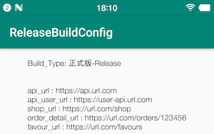

#场景
App里包含Api的Url,web网址,变量,这些值在开发环境(线下)和正式环境(线上)是不同的,因为项目需要我打三个包,一个是开发环境,就是咱们调试debug,第二个是sandbox包,这个其实就是beta版本,给测试用户安装使用,反馈问题的版本,第三个包是release包,这个版本放的Api的Url,web网址,变量都是需要访问正式服务器的.

#教程&使用
[Android打包设置Debug与Release环境切换(build.gradle buildTypes properties env)](https://juejin.im/post/5db66f966fb9a0202f0c8fa8)

#效果

